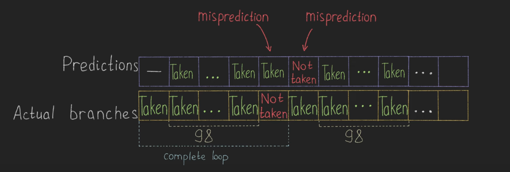
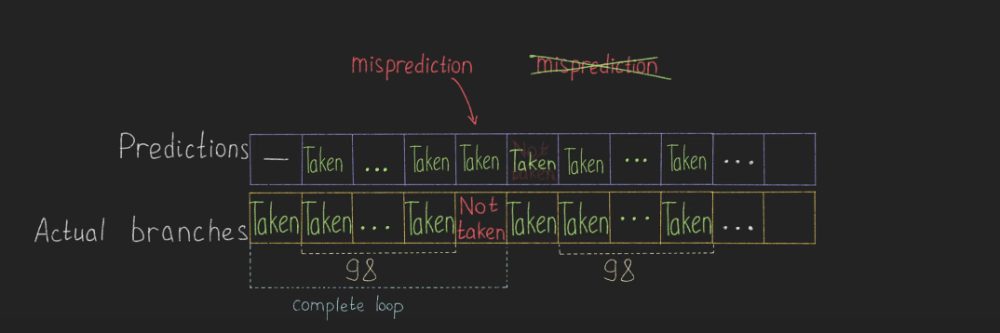
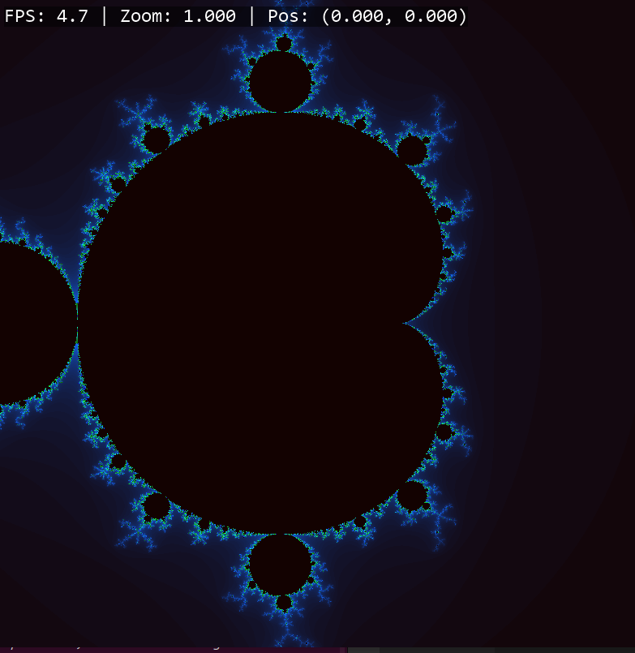
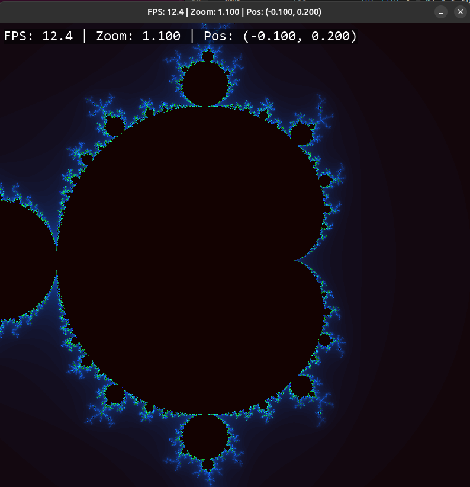
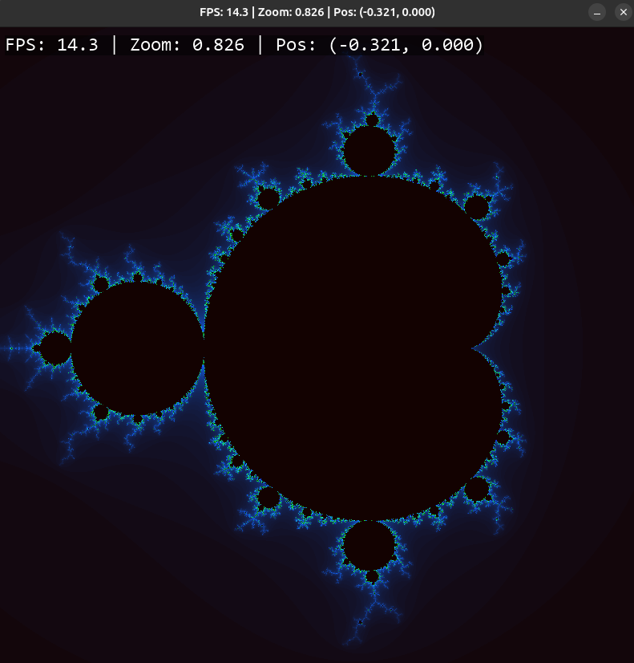
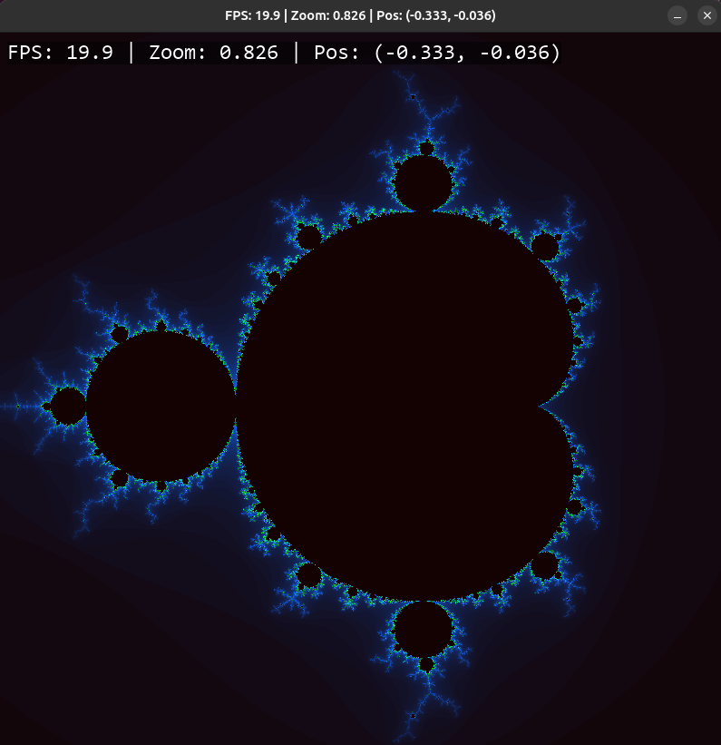

# MandelBrot Research
```
Author: BARKIR
HELPERS: BRYANT O'HALLARON && APHEX TWIN (・_・)ゞ
```


# Сборка
1. Клонируем репозиторий ```git clone https://github.com/Barkir/Mandelbrot```
2. Собираем (доступен выбор компилятора: ```make CC=clang // make CC=g++```)
3. Запускаем ```./run``` + флаги

## Опции запуска
| Grpahics Mode | Optimization | Iterations |
|---------------|--------------|------------|
|  ```--ngraph/--graph```| ```-def // -array // -sse // -avx``` | ```number of iterations (ngraph mode only)```


## Структуа проекта

```
├── bin 
├── consolas.ttf
├── include
│   ├── graph.h
│   ├── main.h
│   ├── ngraph.h
│   └── process_cmd.h
├── Makefile
├── README.md
├── run
└── src
    ├── graph.cpp
    ├── main.cpp
    ├── ngraph.cpp
    └── process_cmd.cpp

```


# Ускорение построения множества мандельброта с использованием SIMD.
**Цели работы**
- Рассчитать множество мандельброта
- Ускороить расчет с помощью SIMD и intrinsic функций

  ## Аннотация
  Множество мандельброта задается на комлексной плоскости следующим уравнением

  $z_n = z_{n - 1}^2 + z_0$

  **SIMD (Single Instruction Multiple Data)** - принцип компьютерных вычислений, позволяющий обеспечить параллелизм на уровне данных.

  ### Немного ~~нудятины~~ теории
  #### SEQ-model (последовательная)
В этой модели инструкции выполняются в 5 этапов

1. Fetch
   - Читаем 10 байт из памяти по адресу PC
2. Decode
   - Взаимойдействи портов чтения **srcA, srcB** и портов записи - **dstE, dstM**
3. Execute
   - Выполняются операции на АЛУ и вычисление адресов переходов
4. Memory
   - Чтение, запись данных из памяти по адресу
   - Обработка кэш-миссов
5. Writeback
   - Запись данных из памяти в регистр
6. PC increment
   - Переход к следующей инструкции


Минусы в том, что за один такт может выполняться только один этап одной инструкции, в то время как другие этапы других инструкции простаивают. Поэтому перейдем к следующей модели, где эта проблема решена.

#### PIPE model (конвейер)
- Основное изменение - добавление конвейерных регистров для выполнения разных этапов разных инструкций.
- Разные этапы разных инструкций выполняются параллельно, если у них нету зависимости по данным (data hazard)

##### Как бороться с data hazards?

1. Forwarding (пересылка данных)
   - Данные передаются напрямую из одной стадии конвейера в другую, минуя этап записис в регистры.
2. Stalling (задержка)
   - Приостановление выполнения следующих инструкций, с помощью добавления пустых инструкций (bubbles) в конвейер.

#### Branch prediction

Данный механизм предсказывает результаты условных переходов до того как они завершатся.
Этот механизм необходим для конвейерной модели, так как если процессор будет ждать вычисления условия, придется останавливать конвейер.

###### Виды static branch prediction
- Always taken (AT)
- Never taken (NT)
- Backward taken, forward not taken (BTFNT) (jmp на верхние адреса, например в циклах)

###### Виды dynamic branch prediction

Самые простые - **once taken, twice taken**.

Если переход был выполнен один раз, то процессор и дальше будет предсказывать этот переход.

Однако более эффективным будет предсказывать переход после двух успешных условных переходов, что лучше видно на рисунке.




- Вместо 2 misprediction получили 1, как следствие x2 по скорости.


---
- Для визуализации используем библиотеку SDL.
- Используем компилятор ``gcc, clang`` с флагами ```-O2``` или ```-O3```
- Для линковки библиотеки SDL используем флаги ```-lSDL2, -lSDL2_image```
- Для подключения intrinsic функций используем флаги ```-mavx2, -mavx2, -mfma, -mavx512vl```
- Для установки частоты 3Ghz используем команду

  ```
  sudo cpupower frequency-set -u 3.0 Ghz
  ```

  ## Характеристики ПК
  | OS | Hardware |
  |------|------|
  | Ubuntu 24.10 | AMD Ryzen 7 6800H with Radeon Graphics            3.20 GHz |
  | DESKTOP-JTSUO0I       | 16 GB RAM                                                  |
  | Ubuntu clang version 19.1.1 (1ubuntu1) |
  | gcc (Ubuntu 14.2.0-4ubuntu2) 14.2.0    |


  ## Ход работы
  ### Реализация без SIMD

<details>
    <summary>Посмотреть код</summary>

```c
    for (int y = 0; y < SDL_SCREEN_HEIGHT; y++)
    {
        for (int x = 0; x < SDL_SCREEN_WIDTH; x++)
        {
            float x0 = -1.f + x * 2.f / SDL_SCREEN_WIDTH;

            float y0 = -1.f + y * 2.f / SDL_SCREEN_HEIGHT;
            float z_x    = 0;
            float z_y    = 0;
            float z_x2   = 0;
            float z_y2   = 0;
            float rmax   = 4;

            volatile int it = 0;
            for (; it < Niter; it++)
            {
                z_y = 2 * z_y * z_x + y0;
                z_x = z_x2 - z_y2 + x0;

                if (z_x2 + z_y2 > rmax)
                {
                    *dots_pointer = it;
                    dots_pointer++;
                    break;
                }

                z_x2 = z_x * z_x;
                z_y2 = z_y * z_y;

            }
        }
    }
  ```

</details>

Считаем в цикле по одной точке и сохраняем в итоговый массив количество итераций, на которой эта точка улетела в бесконечность. В зависимости от этого числа и будем выбирать цвет.


### Реализация с AVX функциями
<details>
    <summary>Посмотреть код</summary>
```c

    alignas(32) __m256 mdely = _mm256_set1_ps(dely);
    alignas(32) __m256 mdelx = _mm256_set1_ps(delx);
    alignas(32) __m256 dy =   _mm256_set1_ps(param->stpy);
    alignas(32) __m256 dx =   _mm256_set1_ps(param->stpx * param->pksz);
    alignas(32) __m256 sdx =  _mm256_set1_ps(param->stpx);
    alignas(32) __m256 bias = _mm256_set_ps(7.f, 6.f, 5.f, 4.f, 3.f, 2.f, 1.f, 0.f);
    alignas(32) __m256 rmax = _mm256_set1_ps(param->rmax);


    alignas(32) __m256 y0 = _mm256_set1_ps(-1.0f);

    for (int y = 0; y < SDL_SCREEN_HEIGHT; y++, y0 = _mm256_add_ps(y0, dy))
    {

        alignas(32) __m256 x0 = _mm256_add_ps(_mm256_mul_ps(bias, sdx), _mm256_set1_ps(-1.f));

        for (int x = 0; x < SDL_SCREEN_WIDTH; x += param->pksz, x0 = _mm256_add_ps(x0, dx))
        {
            alignas(32) __m256 z_x      = _mm256_setzero_ps();
            alignas(32) __m256 z_y      = _mm256_setzero_ps();
            alignas(32) __m256 z_x2     = _mm256_setzero_ps();
            alignas(32) __m256 z_y2     = _mm256_setzero_ps();
            alignas(32) __m256i iter    = _mm256_setzero_si256();

            for (int i = 0; i < Niter; i++)
            {
                z_y = _mm256_add_ps(_mm256_mul_ps(_mm256_mul_ps(z_y, z_x), _mm256_set1_ps(2)), _mm256_add_ps(_mm256_mul_ps(y0, _mm256_set1_ps(ampl)), mdely));
                z_x = _mm256_add_ps(_mm256_sub_ps(z_x2, z_y2), _mm256_add_ps(_mm256_mul_ps(x0, _mm256_set1_ps(ampl)), mdely));

                __m256 r2 = _mm256_add_ps(z_x2, z_y2);
                __m256 mask = _mm256_cmp_ps(r2, rmax, _CMP_LT_OS);
                iter = _mm256_sub_epi32(iter, _mm256_castps_si256(mask);
                int mask2int = _mm256_movemask_ps(mask);
                if (mask2int == 0x00)
                {
                    alignas(32) int integers[8] = {};
                    _mm256_store_epi32(integers, iter);

                    for (int i = 0; i < param->pksz; i++)
                        dots[(x + i) + y * SDL_SCREEN_HEIGHT] = integers[i];

                    break;
                }
                z_x2 = _mm256_mul_ps(z_x, z_x);
                z_y2 = _mm256_mul_ps(z_y, z_y);
            }
        }
    }

</details>


# Визуализация

| Mode |  Image | GodBolt |
|------|--------|---------|
| Default |  | [-> Compiler Explorer <-](https://godbolt.org/z/7oca99vaW)
| Arrays |  | [-> Compiler Explorer <-](https://godbolt.org/z/5Yjoh9sjv)
| SSE |  | [-> Compiler Explorer <-](https://godbolt.org/z/Md5ha8Ea1)
| AVX |  | [-> Compiler Explorer <-](https://godbolt.org/z/Md5ha8Ea1)


# Измерения
- Проведем различные измерения на компиляторах ```gcc, clang``` с флагами оптимизации ```-O2, -O3``` на частоте процессора ```3Ghz```
- Проводим 1000 измерений


## GCC -O2


| Версия       | Среднее время (с) | Погрешность (σ) | Ускорение (раз) | График распределения |
|--------------|-------------------|-----------------|-----------------|----------------------|
| **DEFAULT**  | 0.47315           | ±1.3×10⁻⁵       | 1.00 (база)     |  |
| **ARRAY**    | 0.12503           | ±2×10⁻⁶         | 3.78            |  |
| **SSE**      | 0.1304322         | ±8×10⁻⁷         | 3.63            |  |
| **AVX**      | 0.0654670         | ±6×10⁻⁷         | 7.23            |  |


## CLANG -O2


| Версия       | Среднее время (с) | Погрешность (σ) | Ускорение (раз) | График распределения |
|--------------|-------------------|-----------------|-----------------|----------------------|
| **DEFAULT**  | 0.45025          | ±1.2×10⁻⁵      | 1.00 (база)     |  |
| **ARRAY**    | 0.130209         | ±1.98×10⁻⁶         | 3.45            |  |
| **SSE**      | 0.129783          | ±1.98×10⁻⁶          | 3.87            |  |
| **AVX**      | 0.071361         | ±6.7×10⁻⁷         | 7.14            |  |


## CLANG -O3


| Версия       | Среднее время (с) | Погрешность (σ) | Ускорение (раз) | График распределения |
|--------------|-------------------|-----------------|-----------------|----------------------|
| **DEFAULT**  | 0.507192          | ±1.38×10⁻⁵      | 1.00 (база)     |  |
| **ARRAY**    | 0.1309352         | ±2×10⁻⁶         | 3.87            |  |
| **SSE**      | 0.130024          | ±1.9×10⁻⁶          | 3.89           |  |
| **AVX**      | 0.0707701         | ±6×10⁻⁷         | 7.16            |  |


## Анализ графиков

### AVX
- Наименьший разброс значений (±6×10⁻⁷)
- Чёткий пик около 0.0655 с
- Подтверждает эффективность обработки 8 чисел за такт

### SSE/ARRAY
- Схожие распределения (±8×10⁻⁷ и ±2×10⁻⁶ соответственно)
- Пики в районе 0.13 с

### DEFAULT
- Наибольший разброс (±1.3×10⁻⁵)
- Медленнее всех (~0.47 с)


## Выводы
- Проведены измерения подсчета множества Мандельброта с использованием intrinsic-функций. Проведено два независимых исследования, выполненных при частоте процессора 3Ghz для компиляторов ```gcc, clang``` с флагами   ```-O2, -O3```.


Наибольший прирост к скорости удалось достичь при использовании компилятора GCC, но видимых различий по сравнению с Clang не наблюдается. В среднем версия с SSE увеличивает скорость подсчета в **3.78 раз**, а версия с AVX увеличичвает скорость подсчета в **7.17 раз**

## че делать, если ничего не понял
- Читай [БХ](https://api.pageplace.de/preview/DT0400.9785970604922_A48645377/preview-9785970604922_A48645377.pdf)
- Смотри [BH](https://www.youtube.com/watch?v=4CpHpFu_KYM&list=PLyboo2CCDSWnhzzzzDQ3OBPrRiIjl-aIE) (ну да, они скопировали весь курс у северова и что)


